## Mô tả
Khởi tạo Vision One Instance dành cho khách hàng hiện hữu.  
Yêu cầu: có sẵn license key của sản phẩm đang sử dụng và root account của CLP portal (https://clp.trendmicro.com)

## Qui trình
1. Truy cập Trend Vision One để bắt đầu khởi tạo Instance
link: https://signin.v1.trendmicro.com 

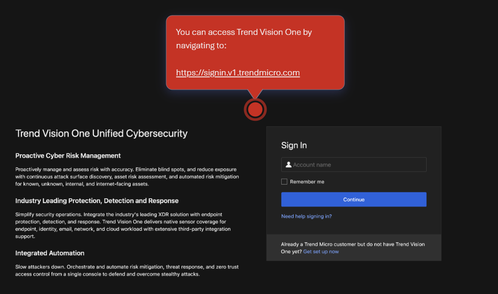

2. Trường hợp khách hàng chưa có Vision One Instance, chọn "Get set up now"
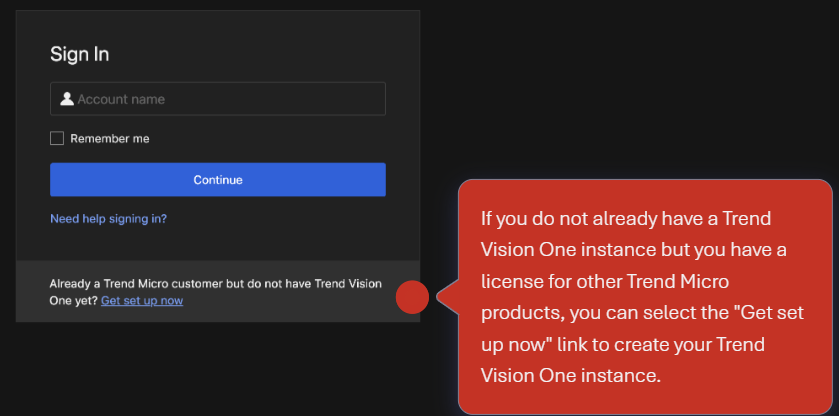

3. Điền Activation Code vào  
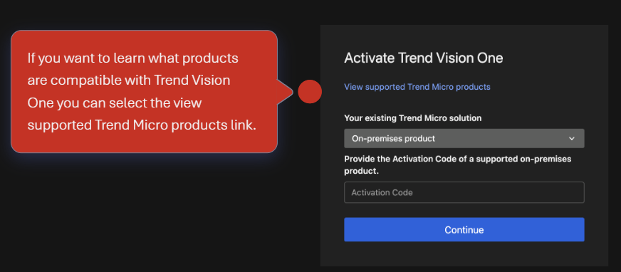

4. Nhập Primay User Account, giống với account mà khách hàng đăng nhập vào CLP.
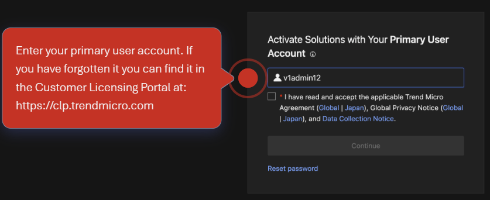

Chọn chấp nhận điều khoản "Trend Micro Agreement"

5. Bạn sẽ được yêu cầu kích hoạt license dành cho tổ chức của bạn. Đăng nhập bằng mật khẩu của account CLP đã cung cấp  
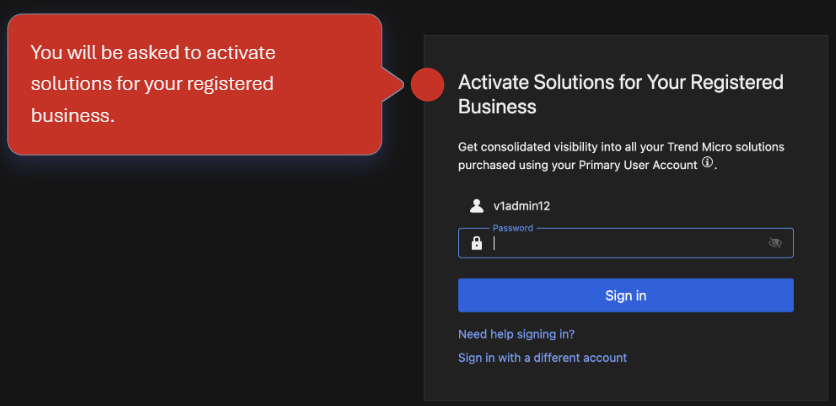

Click "Sign In"

6. Hệ thống sẽ Activate  
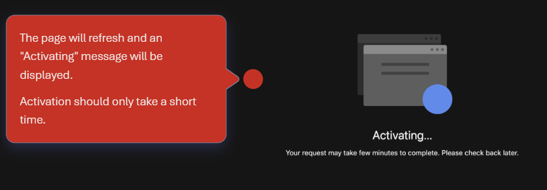

7. Thiết lập Email dành cho root account. Email account này được xem là account gốc của Vision One dành cho doanh nghiệp.
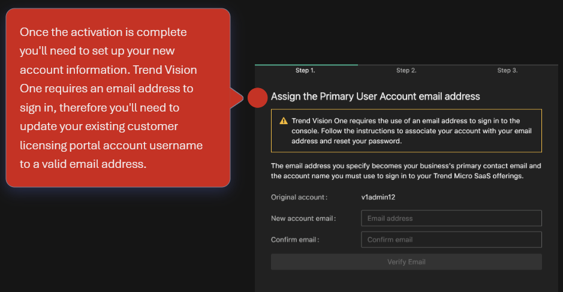

Click Verify Email. Lưu ý: email này sẽ phải valid và nhận được email xác nhận từ Trend Micro

8. Email sẽ gửi đến email box mã số OTP để xác nhận địa chỉ email hiệu lực. Điền mã OTP vào để xác nhận  
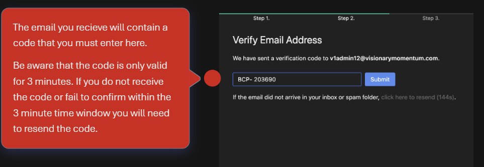

9. Cập nhật Password
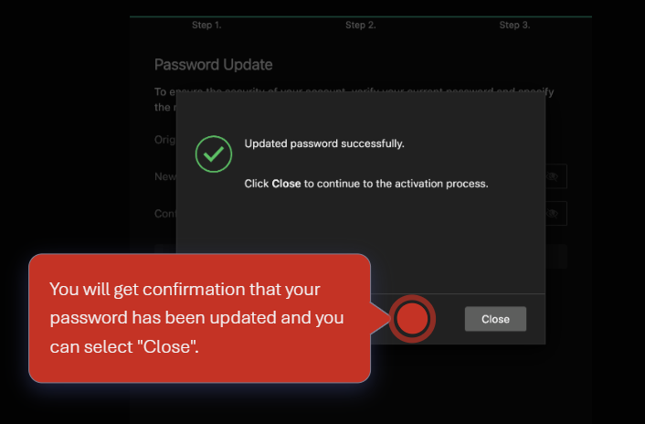

10. Sử dụng account vừa đăng ký để login vào Vision One Portal
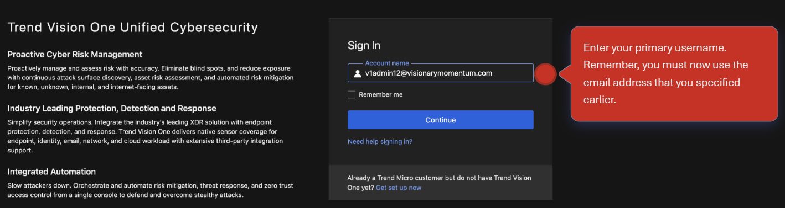

11. Chọn Data Center Region >> Khuyến nghị chọn Region gần với Workload của mình nhất. Đối với khách hàng ở Việt Nam, thường chọn "Singapore"
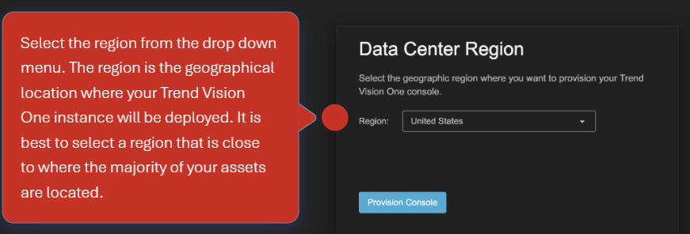

12. Sau khi provisioning hoàn thành, khách hàng có thể truy cập được vào Vision One Portal bình thường.  
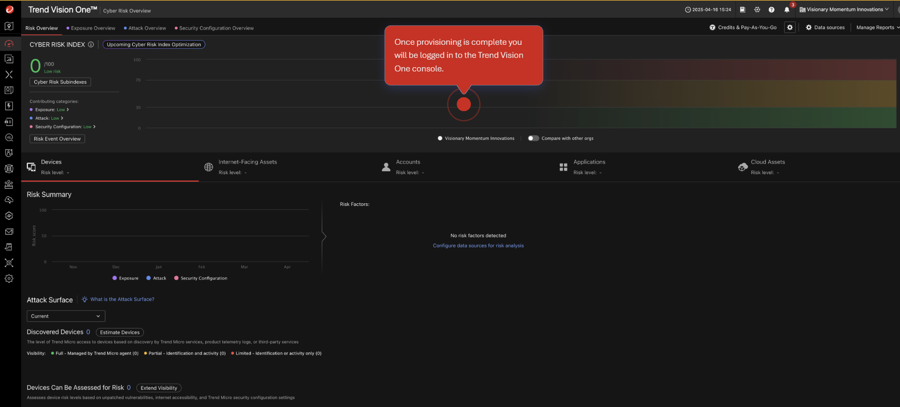

13. Kiểm tra các license của tổ chức thể hiện lên ở đây. Điều hướng Administration >> License Information  
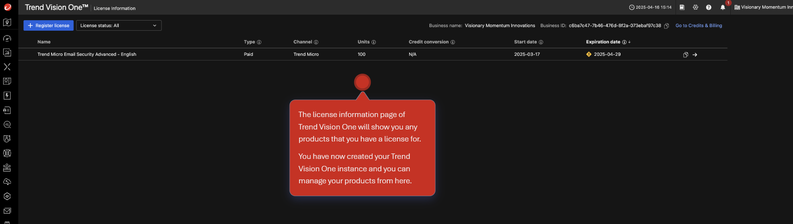