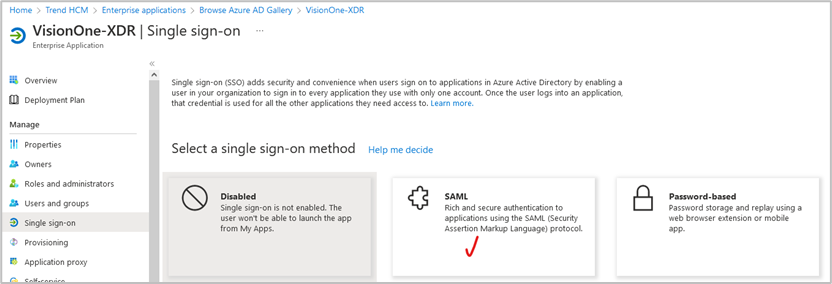

## Mô tả
Configuring Single Sign-On (SSO) Settings for User Authentication

Hướng dẫn tích hợp Vision One SAML SSO với Entra ID  
Tích hợp SAML SSO với Microsoft Entra ID, cho phép Vision One chuyển tiếp yêu cầu xác thực đến Entra ID.

## Các bước thực hiện
1.	Đăng nhập Microsoft Entra ID >> Enterprise Application >> New Application >> Create your own application
2.	Setup SSO >> SAML 
3.	Upload metadata file
4.	Cấu hình SAML
5.	Download cert và import vào Vision One

## Kết quả
Kiểm tra license Entra ID  

+ Enterprise Application >> New Application >> Create your own application.  

+ Chọn Property của App >> Assignment Required >> Disable  

+Setup Single Sign-On. Chọn Single-Sign On ở cột bên trái  

+ SAML  

+ Upload metadata file  

+ Lấy file metadata từ Vision One >> Administration >> Identity Provider. 
Tạo mới Identity Provider  

+ Add metadata file  

+ Open metadata file bằng Notepad++. Lưu lại các địa chỉ sau để đối chiếu lại với bên dưới, không cần chỉnh nếu không khớp  
-	Dành cho Identifier (Entity ID)
Note: không cần input cho trường Reply, Login, Logout  
+ SAVE  
  

+ User attribute. Đảm bảo thuộc tính sẽ theo form: user.userprincipalname  

+ Download SAML certificate  
  

+Import Federation Metadata XML file to Vision One  

Kết nối thành công. Thực hiện Test:  

Kiểm tra sign-in log  
