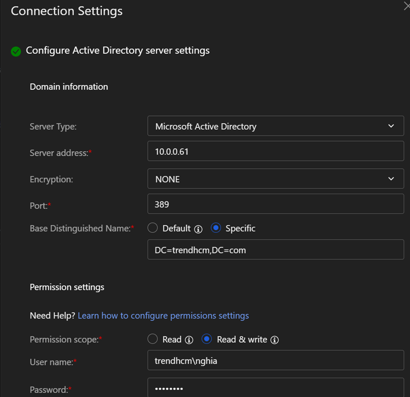
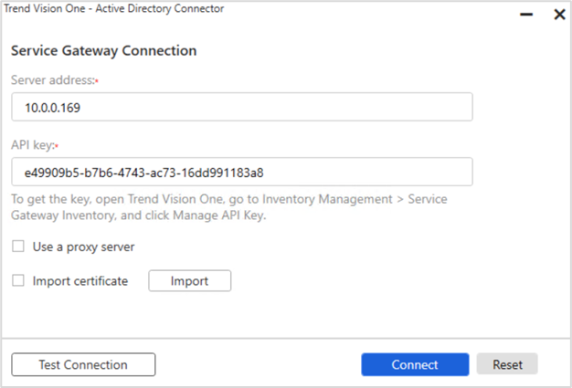

## Mô tả
Hướng dẫn tích hợp Vision One với Active Directory On-Premises
Cho phép Vision One truy cập user data và áp đặt chính sách cho các truy cập của người dùng trong mạng nội bộ. Đồng bộ dữ liệu và kiểm soát truy cập người dùng. Cài đặt AD Connector để forward logs trên Active Directory

## Các bước thực hiện
1. Đã cài đặt V1 Service Gateway	
2. Enable Active Directory On-Premises và Log Forwarder trên Service Gateway
3. Cấu hình tích hợp V1 với Active Directory

## Kết quả
Bật chức năng Directory connector và Log forward trên service gateway.

Log Forwarding

Enable AD Integration

Kiểm tra Data Source

Kiểm tra trong Identity Posture:

Note: nếu trường hợp V1 và AD On-premises không đồng bộ được user account, có thể work-around restart Active Directory, hoặc mở case