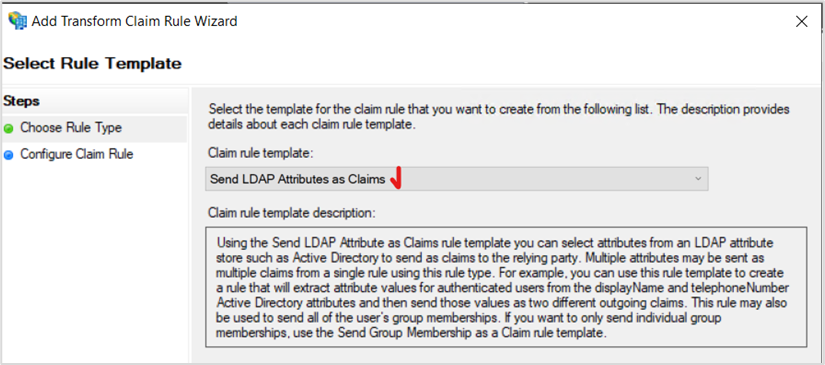

## Mô tả
Test case: Tích hợp Vision One với ADFS On-Premises
Vision One hỗ trợ tích hợp IAM với ADFS on-premies. Yêu cầu bắt buộc
-	Có sẵn Active Directory và đã tích hợp ở bài test trên
-	Có sẵn ADFS

## Các bước thực hiện
1.	Tham khảo hướng dẫn chi tiết tại: https://www.docs.trendmicro.com/en-us/enterprise/trend-vision-one/administrative-setti/saml-single-sign-on/configuring-saml-sin/configuring-active-d.aspx
2.	Test với SAML account

Note: có thể tham khảo file **./MS_Cài đặt ADFS và cấu hình_v1.pdf**

## Kết quả
Cấu hình khai báo trên ADFS
Click AD FS in the left navigation, and under the Action area on the right, click **Add Relying Party Trust....**

On the Select Data Source tab, select **Import data about the relying party from a file**, click Browse to select the **metadata file** you obtain from Trend Vision One; then, click Next.

On the Configure Multi-factor Authentication Now? tab, leave Multifactor Authentication at default and click Next. (IGNORE)
On the Choose Issuance Authorization Rules tab, select Permit all users to access this relying party and click Next.

On the Ready to Add Trust tab, click Next.

On the Finish tab, select Open the Edit Claim Rules dialog for this relying party trust when the wizard closes and click Close. 
The Edit Claim Rules screen appears.

  

Complete settings on each tab of the **Add Transform Claim Rule Wizard** screen. 
On the Choose Rule Type tab, select **Send LDAP Attributes as Claims** from the Claim rule template drop-down list, and click **Next**.

On the Configure Claim Rule tab, specify a claim rule name in the Claim rule name text box, and **select Active Directory** from the Attribute store drop-down list.
Select the following LDAP attributes and specify an outgoing claim type for each attribute: select **E-Mail-Addresses** and set it to **E-Mail-Address**; select **User-Principal-Name** and set it to **Name**.

Click Finish.

•  Click Add Rule.... 
•  Complete settings on each tab of the **Add Transform Claim Rule Wizard** screen. 
On the Choose Rule Type tab, select **Transform an Incoming Claim** from the Claim rule template drop-down list, and click Next. 

On the Configure Claim Rule tab, specify a claim rule name in the Claim rule name text box, and select or type **E-Mail Address** for **Incoming claim type**, **Name ID** for **Outgoing claim type**, and **Email** for **Outgoing name ID format**.
•  Select **Pass through all claim values**, and click Finish.

Collect the single sign-on URL and export the Identity Provider metadata for ADFS.
•  On the ADFS management console, go to ADFS > Service > Endpoints.
•  In the right pane, under Endpoints > Metadata, in the Federation Metadata row, copy the URL path.

Add the host name of the AD FS computer to the URL path that you copied.
Example: https://adfs.trendmicro-one.com/FederationMetadata/2007-06/FederationMetadata.xml
•  To retrieve the Identity Provider metadata, use a web browser to navigate to the complete URL that you obtained in the previous step. 
•  Save the Identity Provider metadata file as an XML file.

Import this metadata file to Trend Vision One.

Kiểm tra bằng cách tạo một account SAML đăng nhập vào V1. Lưu ý: domain này là duy nhất trên hệ thống Trend Micro Vision One. Nếu có vấn đề thì có thể tạo một UPN mới trên AD, tạo user và thử lại

Kiểm tra email trên AD đảm bảo user đã khai báo

Đảm bảo email đã phù hợp

Test với Zero Trust Internet Access nếu đã setup

  
