## Mô tả
Test case: Tích hợp Vision One với Entra ID (IAM)
Tích hợp Vision One với Entra ID. Cho phép Vision One truy cập user information trên Entra ID

## Các bước thực hiện
1.	Vision One >> Workflow and Automation >> Third-Party Integration >> Microsoft Entra ID ( & Microsoft Cloud Apps)
2.	Microsoft Entra ID
3.	Grant permission

## Kết quả
Tìm mục Microsoft trong 3rd party để thực hiện kết nối  

Nhập account để gán quyền (Grand permission)

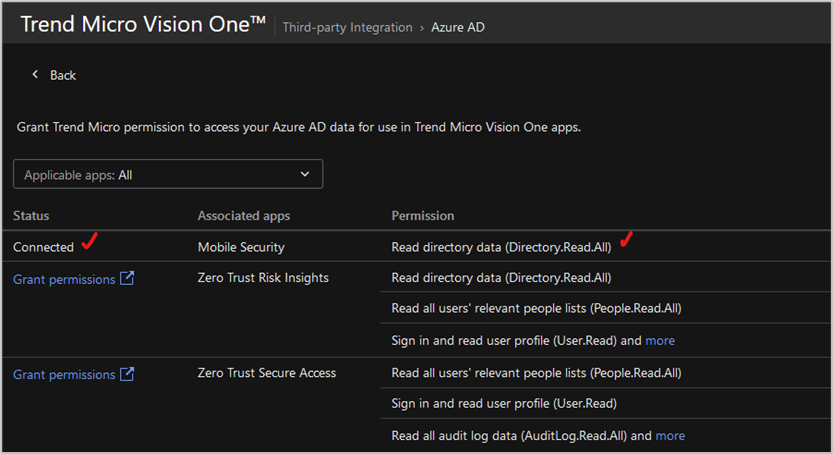

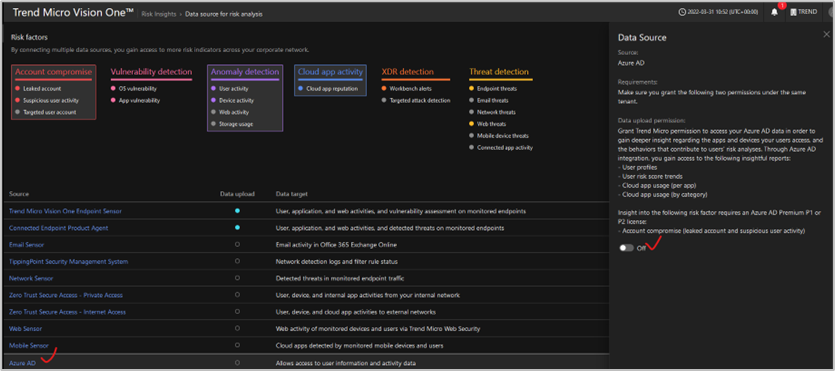

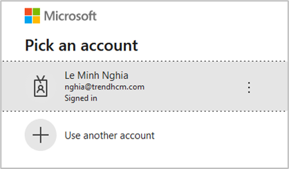

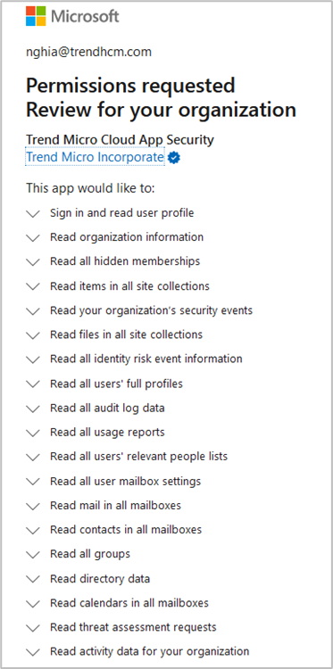

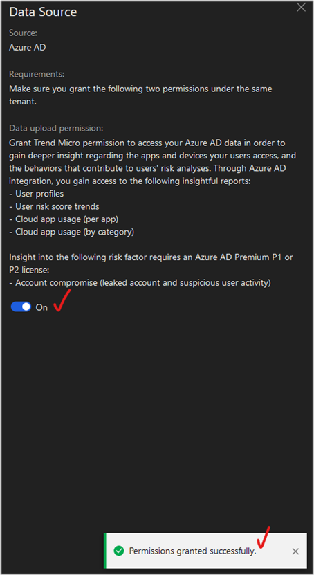

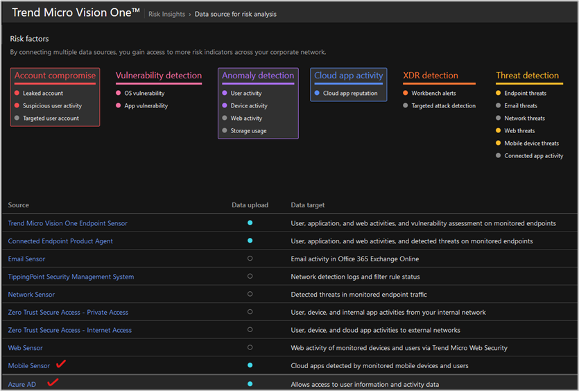

Kiểm tra lại

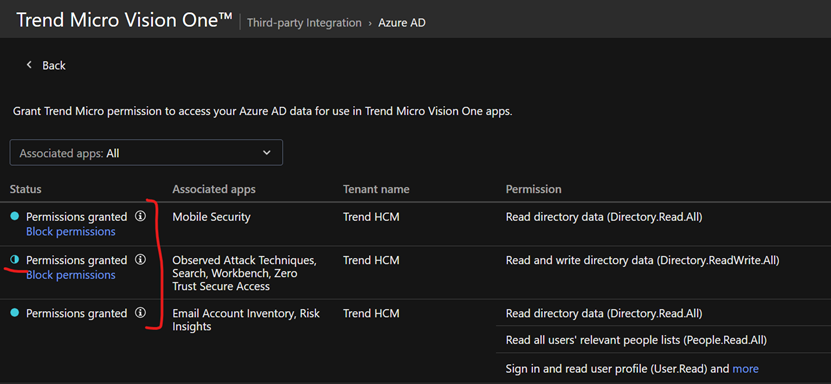

Nếu mục permission granted có một mục chưa tích hợp thành công, click vào (i) để xem chi tiết, ở bài test này là chưa cấu hình password management role

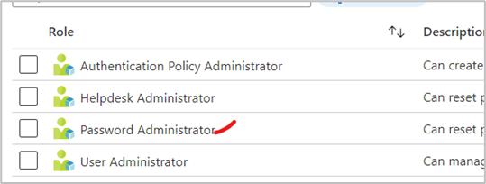

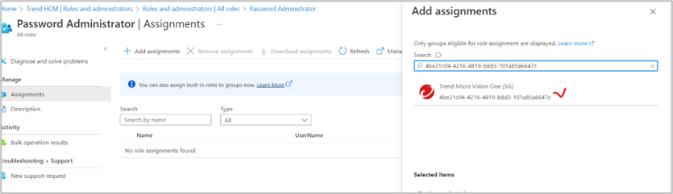

Kiểm tra lại

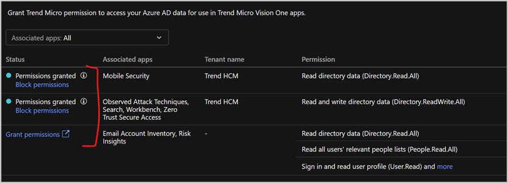

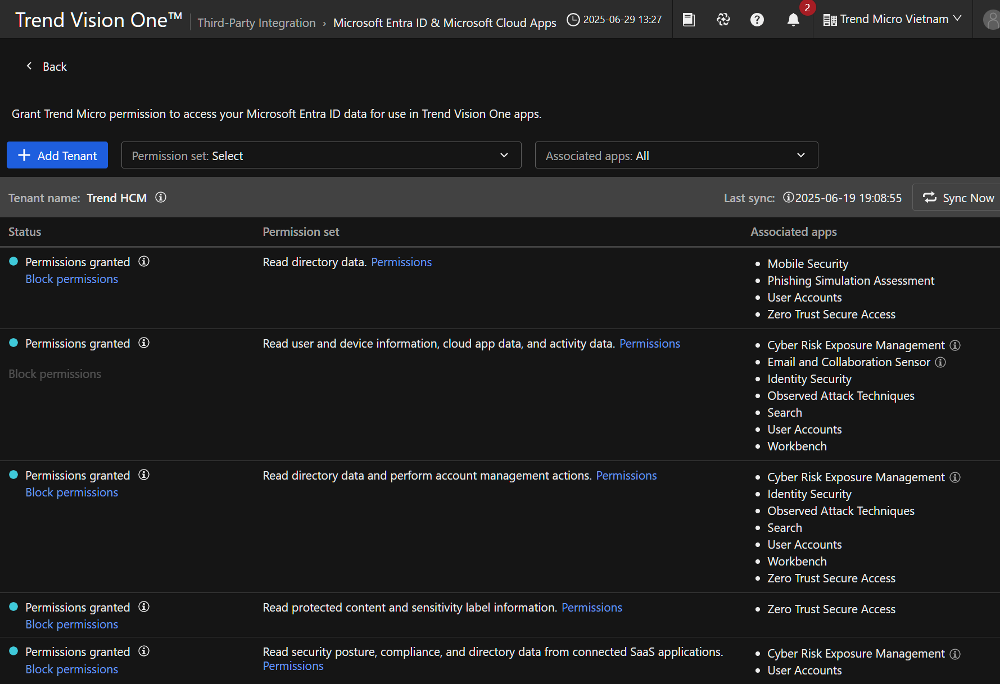