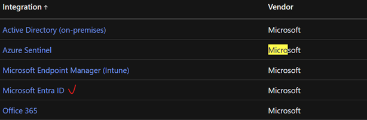
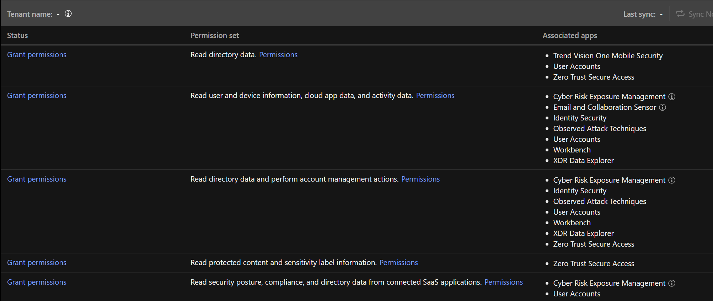
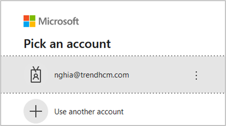
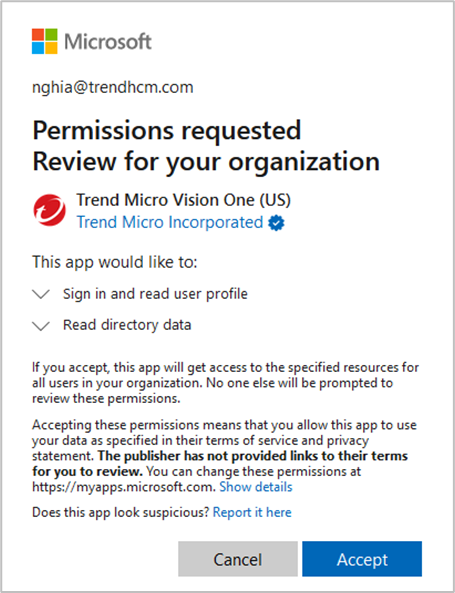
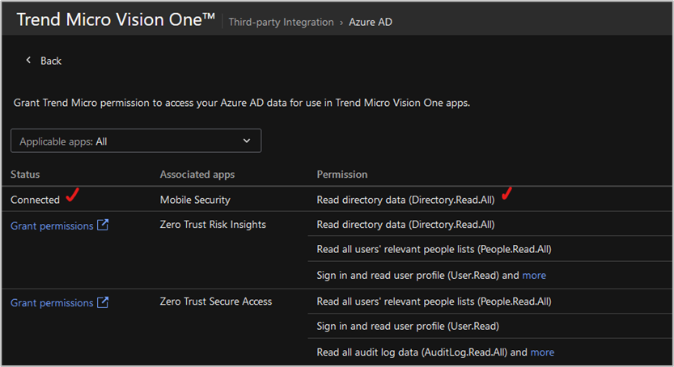
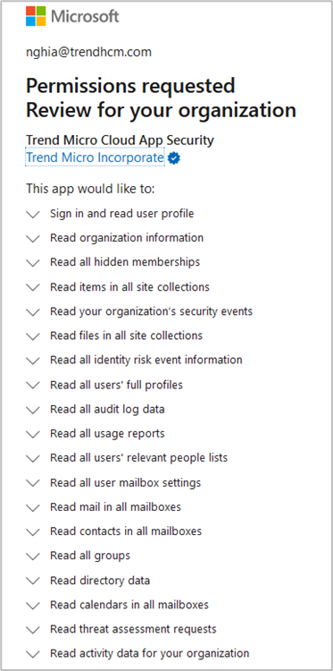
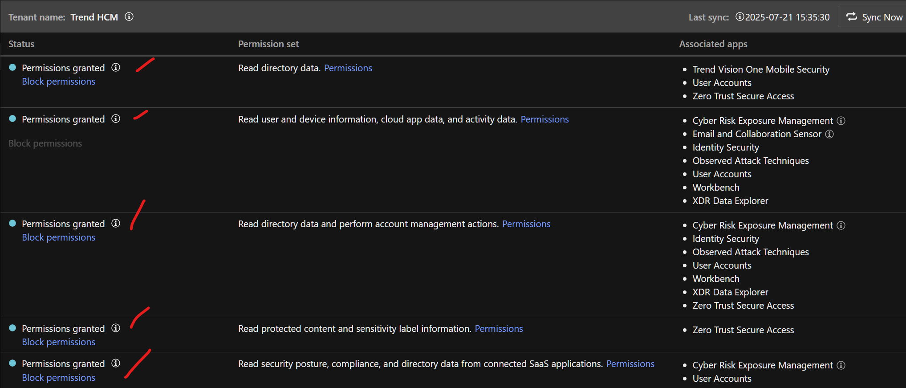

## Mô tả
Test case: Tích hợp Vision One với Entra ID (IAM)
Tích hợp Vision One với Entra ID. Cho phép Vision One truy cập user information trên Entra ID

## Các bước thực hiện
1.	Vision One >> Workflow and Automation >> Third-Party Integration >> Microsoft Entra ID ( & Microsoft Cloud Apps)
2.	Microsoft Entra ID
3.	Grant permission

## Kết quả
Tìm mục Microsoft trong 3rd party để thực hiện kết nối  

Chọn +Add Tenant. Và nhập account để gán quyền (Grand permission)

Kiểm tra lại
