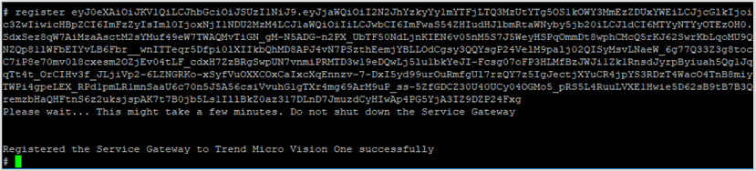

## Mô tả
Triển khai tích hợp Service Gateway
Service gateway được xem như cầu nối (kết nối) giữa Vision One (SaaS) và các hạ tầng/dịch vụ của tổ chức ở on-premises. Service Gateway cho phép Vision One tích hợp chia sẻ Threat Intelligence với các thành phần Trend Micro On-Premises và bên thứ ba chẳng hạn như Microsoft AD, Syslog, Third-party ...

## Các bước thực hiện
1.	Download ova từ Vision One >> Workflow and Automation >> Service Gateway Management
2.	Tiến hành Import vào VMware ESXi (on-premises) thông qua vCenter/ESXi WebUI
3.	Remote SSH và đăng ký service gateway với Vision One. Kiểm tra trên Vision One
4.	Cấu hình service gateway để bật các service tương ứng

## Kết quả
Download từ Vision One >> Workflow and Automation >> Service Gateway Management

Tiến hành import vào VMware (On-premises)

Cấu hình Vision One service gateway (Default account: admin/ V1SG@2021). Chờ một thời gian để hệ thống tự động thiết lập dịch vụ

Change IP (không nên dùng DHCP)

Kiểm tra kết nối Internet thành công

SSH vào Service gateway và tiến hành đăng ký với Vision One (lấy token key ở Service Gateway Inventory)

Kiểm tra trên Vision One service gateway vừa mới đăng ký thành công

Cấu hình Service Gateway >> Manage Service

