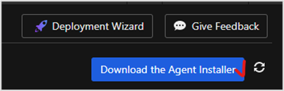
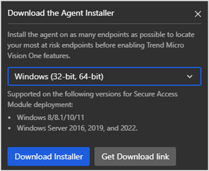
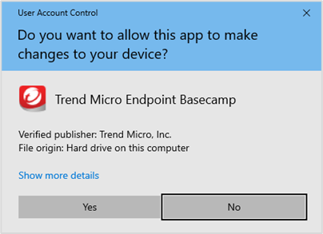
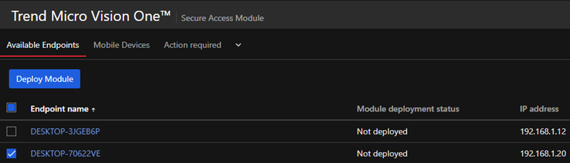
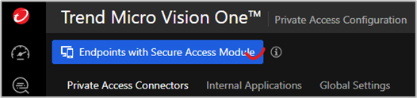
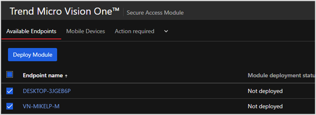
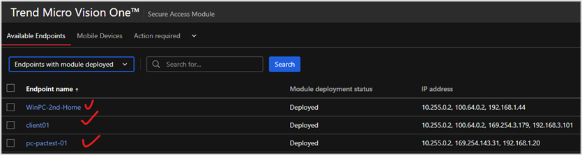
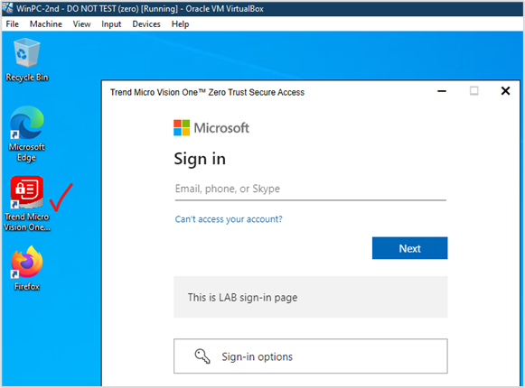
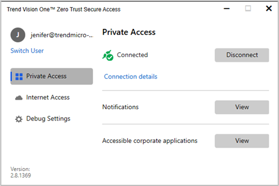
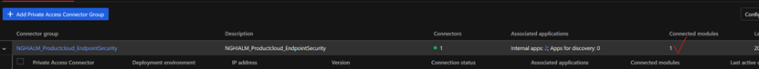

## Mô tả
Triển khai Secure Access Module cho các endpoint muốn kiểm soát bằng ZTSA. Có thể cài thủ công hoặc thực hiện deploy thông qua XDR agent
Sau khi triển khai agent, người dùng có thể thấy các ứng dụng được phép truy cập trên endpoint. Sau khi người dùng đăng nhập vào IAM account (AD account), agent sẽ thiết lập kết nối với Private Access Connector. Connector sẽ kiểm tra/check ứng dụng nội bộ nào mà người dùng được phép truy cập dựa vào policy/rule mà admin thiết lập trên Vision One.

## Các bước thực hiện
1.	Triển khai agent/module thông qua XDR agent
2.	Kiểm tra agent được cài đặt thành công trên endpoint
3.	Có thể cài agent trực tiếp

## Kết quả mong muốn
Có thể download và cài agent trực tiếp vào máy trạm.  

Sau khi cài XDR agent vào thì endpoint sẽ xuất hiện trong mục endpoint có thể được kích hoạt cài Secure Access Module  
  

Chọn máy sẽ deploy

Kiểm tra lại sau khi deploy thành công

Kiểm tra dưới máy trạm  

Sau khi kết nối thành công, trên Vision One sẽ thể hiện số lượng module/agent kết nối vào  

